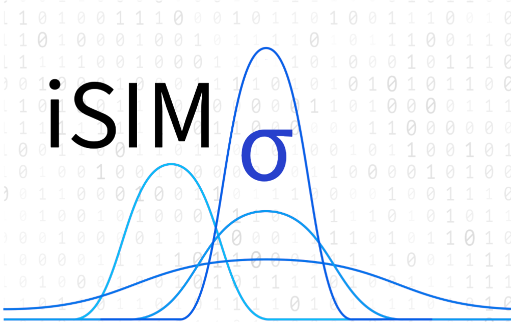

# iSIM-sigma



Authors: 
        Kenneth Lopez Perez klopezperez@ufl.edu
        Ramon Miranda Quintana quintana@chem.ufl.edu
        Bill Zhao

Institution:
        University of Florida

This repository, maintained by the Miranda-Quintana group, includes scripts and notebooks used for the publication.

## Important Note

Before using the fingerprints, ensure that you decompress them using `gzip`. This step is crucial for proper functionality.

## Usage

1. Locate the fingerprint files in the repository.
2. Decompress them by running the following command:
    ```bash
    gzip -d <filename>.gz
    ```
3. Proceed with the scripts and notebooks as described in the publication.

For further details, refer to the documentation or contact the authors.
